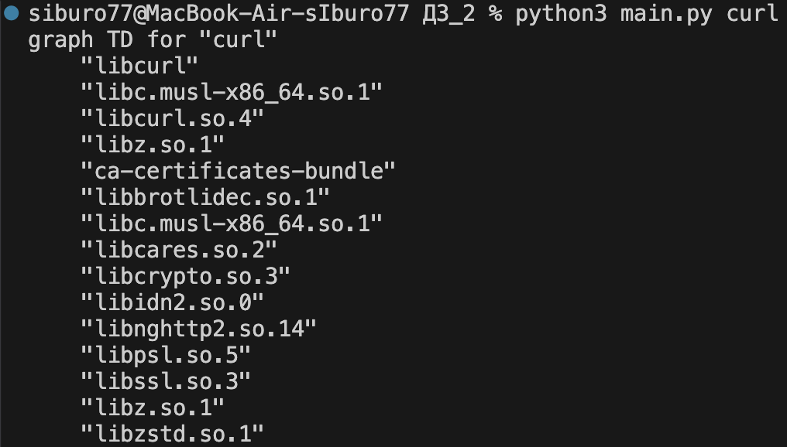

# Задача
##### Разработать инструмент командной строки для визуализации графа зависимостей, включая транзитивные зависимости. Сторонние средства для получения зависимостей использовать нельзя.
##### Зависимости определяются по имени пакета ОС Alpine Linux (apk). Для описания графа зависимостей используется представление Mermaid. Визуализатор должен выводить результат на экран в виде графического изображения графа.
### Ключами командной строки задаются:
1. Путь к программе для визуализации графов.
2. Путь к анализируемому пакету.
3. Путь к файлу-результату в виде кода.
4. URL-адрес репозитория.
##### Все функции визуализатора зависимостей должны быть покрыты тестами.
## Результат работы

Тестирование прошло успешно