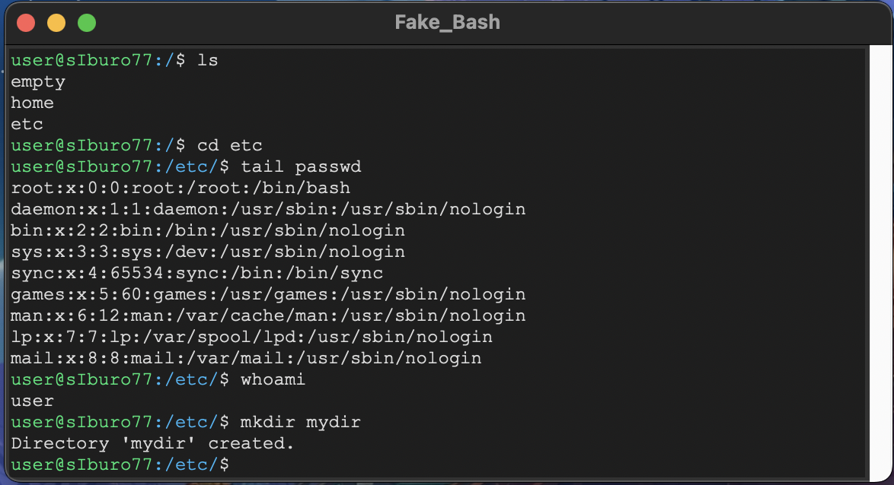

1) Загрузить репозиторий на компьютер.
```
https://github.com/sIburo77/Config_Mirea/tree/main/dz_1
cd dz_1
```
2) Создайте в корне репозитория вирутальную среду Python и активируйте её.
```
python -m venv venv
source venv/bin/activate
```

### Описание
Разработать эмулятор для языка оболочки ОС. Необходимо сделать работу эмулятора как можно более похожей на сеанс shell в UNIX подобной ОС. Эмулятор должен запускаться из реальной командной строки, а файл с виртуальной файловой системой не нужно распаковывать у пользователя. Эмулятор принимает образ виртуальной файловой системы в виде файла формата tar. Эмулятор должен работать в режиме GUI.

Конфигурационный файл имеет формат ini.

### Функции
- Эмуляция команд: ls, cd, exit, whoami, mkdir, tail ;
- Исполнение стартового скрипта при запуске эмулятора.

### Старт проекта
Открыть директорию dz_1 и запустить main.py
```bash
cd dz_1
python main.py
```

### Пример использования
