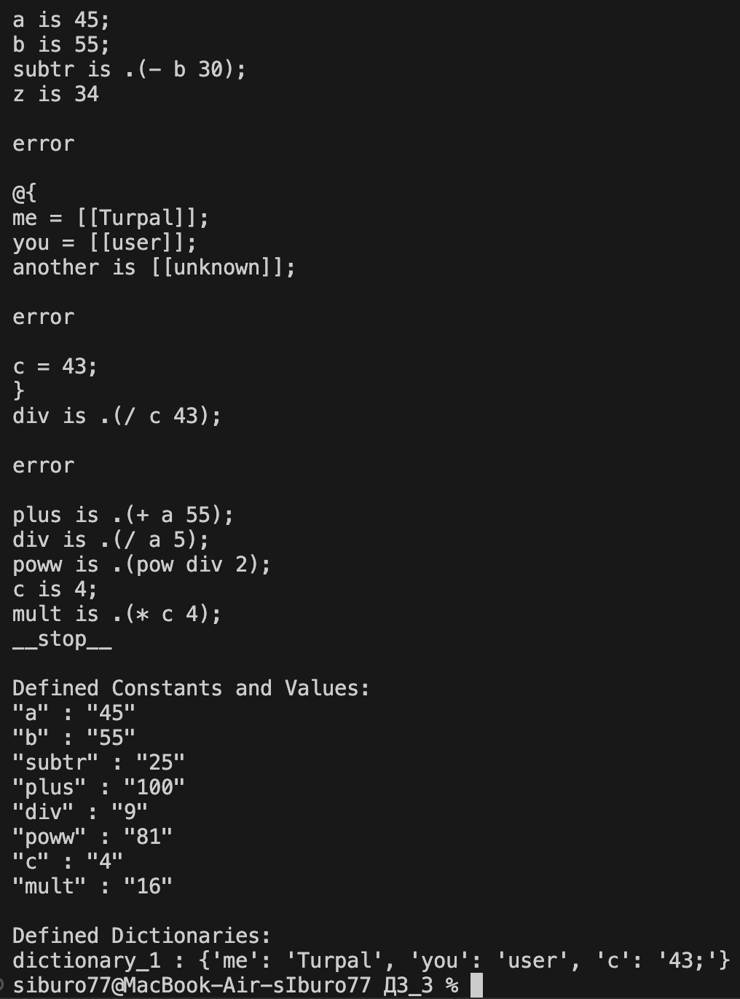

# ДЗ №3
#### Разработать инструмент командной строки для учебного конфигурационного языка, синтаксис которого приведен далее. Этот инструмент преобразует текст из входного формата в выходной. Синтаксические ошибки выявляются с выдачей сообщений.
#### Входной текст на учебном конфигурационном языке принимается из стандартного ввода. Выходной текст на языке xml попадает в стандартный вывод.
##### DA

```
Словари:
@{
  имя = значение;
  имя = значение;
  имя = значение;
 ...
}

Имена:
[a-zA-Z][_a-zA-Z0-9]*

Значения:
• Числа.
• Строки.
• Словари.

Строки:
[[Это строка]]

Объявление константы на этапе трансляции:
имя is значение;

Вычисление константного выражения на этапе трансляции (префиксная форма), пример:
.(+ имя 1).

Результатом вычисления константного выражения является значение.

Для константных вычислений определены операции и функции:
1. Сложение.
2. Вычитание.
3. Умножение.
4. Деление.
5. pow().
```

Все конструкции учебного конфигурационного языка (с учетом их возможной вложенности) должны быть покрыты тестами. Необходимо показать 3 примера описания конфигураций из разных предметных областей.

## Результаты

