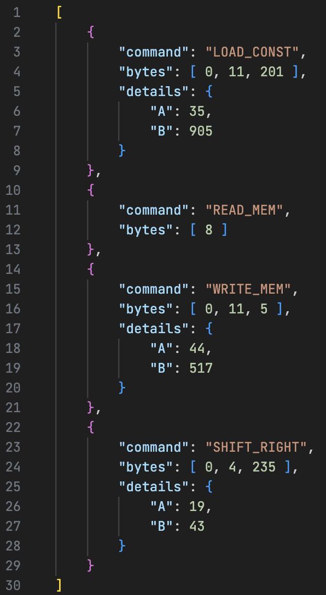

Разработать ассемблер и интерпретатор для учебной виртуальной машины (УВМ). Система команд УВМ представлена далее.

Для ассемблера необходимо разработать читаемое представление команд УВМ. Ассемблер принимает на вход файл с текстом исходной программы, путь к которой задается из командной строки. Результатом работы ассемблера является бинарный файл в виде последовательности байт, путь к которому задается из командной строки. Дополнительный ключ командной строки задает путь к файлулогу, в котором хранятся ассемблированные инструкции в духе списков “ключ=значение”, как в приведенных далее тестах.

Интерпретатор принимает на вход бинарный файл, выполняет команды УВМ и сохраняет в файле-результате значения из диапазона памяти УВМ. Диапазон также указывается из командной строки.

Форматом для файла-лога и файла-результата является json.

Необходимо реализовать приведенные тесты для всех команд, а также
написать и отладить тестовую программу.

### Загрузка константы
| A | B |
| :---:  | :---: |
| Биты 0-5 | Биты 6-18 |
| 35  | Константа  |

Размер команды: 3 байт. Операнд: поле B. Результат: новый элемент на стеке.
```
Тест (A=35, B=905):
0x63, 0xE2, 0x00
```
### Чтение значения из памяти
| A |
| :---:  |
| Биты 0-5 |
| 35  |

Размер команды: 1 байт. Операнд: значение в памяти по адресу, которым является элемент, снятый с вершины стека. Результат: новый элемент на стеке.
```
Тест (A=8):
0x08
```
### Запись значения в память
| A | B |
| :---:  | :---: |
| Биты 0-5 | Биты 6-17 |
| 44  | Смещение  |

Размер команды: 3 байт. Операнд: элемент, снятый с вершины стека. Результат: значение в памяти по адресу, которым является сумма адреса (элемент, снятый с вершины стека) и смещения (поле B).
```
Тест (A=44, B=517):
0x6C, 0x81, 0x00
```
### Бинарная операция: побитовый арифметический сдвиг вправо
| A | B |
| :---:  | :---: |
| Биты 0-5 | Биты 6-17 |
| 19  | Смещение  |

Размер команды: 3 байт. Первый операнд: значение в памяти по адресу, которым является элемент, снятый с вершины стека. Второй операнд: значение в памяти по адресу, которым является сумма адреса (элемент, снятый с вершины стека) и смещения (поле B). Результат: новый элемент на стеке.
```
Тест (A=19, B=43):
0xD3, 0x0A, 0x00
```

### Тестовая программа
Выполнить поэлементно операцию побитовый арифметический сдвиг вправо над
двумя векторами длины 5. Результат записать в новый вектор.

# Результаты


Программа работает со всеми предоставленными требованиями
